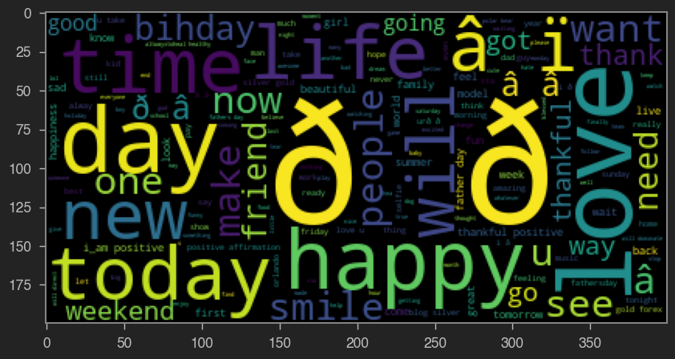
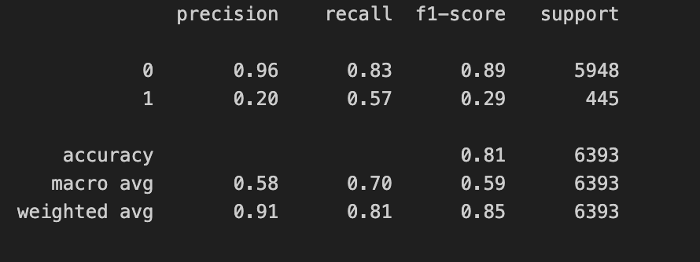
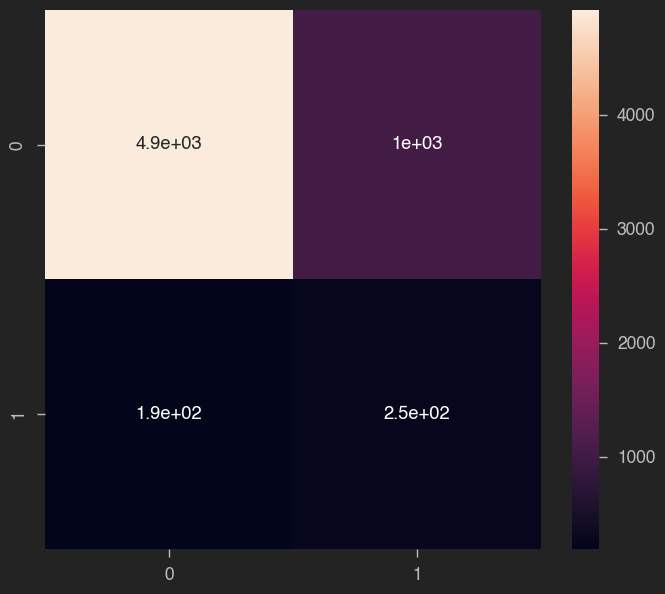

# Sentiment Analysis

## Overview

This script performs a sentiment analysis on X (formerly Twitter) data using a Naive Bayes classifier. Sentiment analysis involves determining the sentiment expressed in a piece of text, which in this case, are tweets. It is useful for any company with a social media presence to automatically predict customer's sentiment (i.e.: whether their customers are happy or not). The project involves data preprocessing, exploratory data analysis, visualization using word clouds, and training a machine learning model to predict sentiment as either positive or negative.

## Key Features

- **Data Preprocessing:** The script cleans the tweet data by removing punctuation and creating a word cloud to visualize the most frequent words in positive and negative tweets.
- **Exploratory Data Analysis (EDA):** The script performs EDA by visualizing the distribution of tweet lengths using histograms.
- **Word Cloud Visualization:** It creates word clouds to visualize the most common words in positive and negative tweets.

- **Naive Bayes Classifier:** The script trains a Multinomial Naive Bayes classifier to predict sentiment based on the tweet content.
- **Evaluation:** The classifier's performance is evaluated using confusion matrix and classification report metrics.




## How To Install

1. **Clone this repository to your local machine:**

    ```
    git clone https://github.com/your_username/twitter-sentiment-analysis.git
    ```
2. **Install the required libraries using pip:**
    ```
    pip install pandas numpy seaborn matplotlib jupyterthemes wordcloud nltk scikit-learn
    ```
3.  **Place your tweet data file (e.g., tweets.csv) in the project directory.**
4.  **Run the script sentiment_analysis.py:**
    ```
    Run the script sentiment_analysis.py:
    ```

## Credits

This script is based off of Coursera's Twitter Sentiment Analysis taught by Ryan Ahmed, Adjunct Professor & AI Enthusiast.
